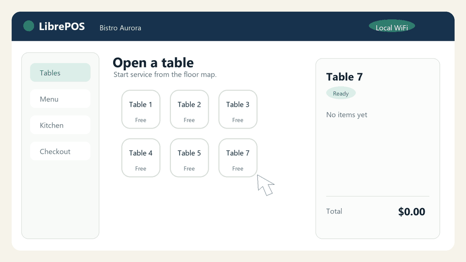

# LibrePOS

LibrePOS is a local point-of-sale app for restaurants. It handles table service,
takeout orders, kitchen tickets, checkout, inventory, product catalogs, users,
staff clock-ins, data export, and LAN sync over WiFi.



## Documentation

- [User guide](docs/USUARIO.md): daily workflows for servers, kitchen, checkout, and admins.
- [Administration and maintenance](docs/ADMINISTRACION.md): installation, local data, backups, recovery, updates, and security.
- [Development](docs/DESARROLLO.md): project structure, commands, architecture, and release checklist.
- [Local API](docs/API_LOCAL.md): internal endpoints used by the app for sync, login, and updates.

The extended docs are still written in Spanish because they were created for the
current operators. The public README is in English for GitHub visitors.

## Quick Start

### macOS

1. Open `Instalar LibrePOS.command`.
2. When it finishes, open `Abrir LibrePOS.command`.
3. The browser opens `http://localhost:5173/`.

### Windows

1. Open `Instalar LibrePOS.bat`.
2. When it finishes, open `Abrir LibrePOS.bat`.
3. The browser opens `http://localhost:5173/`.

The Windows `.bat` launchers use Node.js/npm directly. They do not depend on
Python.

## Initial Login

```text
Username: admin
Password: admin
```

Change the admin password from `Usuarios` before using LibrePOS in a real
restaurant.

## Phone And Tablet Access

The computer running LibrePOS works as the local server. Other devices on the
same WiFi network should not use `localhost`; use the server IP shown in the
startup window, for example:

```text
http://192.168.1.73:5173/
```

The local network and firewall must allow inbound connections to port `5173`.

## Manual Setup

```bash
npm install
npm run build
npm start
```

Available commands:

```bash
npm start      # local Vite server on 0.0.0.0:5173
npm run build  # production build in dist/
npm run preview
npm run update # update from GitHub
```

## Local Data

Restaurant data is stored locally in:

```text
.librepos/state.json
```

The `.librepos/` directory is ignored by Git so sales, users, tokens, and
operational data are not published. To move the POS to another computer, stop
the server and copy the full `.librepos/` directory.

## Updates

LibrePOS checks `https://github.com/JMartinezRuiz/LIbepos` and shows the
`Actualizar` button only to admin users when the `main` branch has new changes.

Updates download the project files, run `npm install`, and keep the full
`.librepos/` directory in place. Sales, tables, users, inventory, clock-ins, and
other local data are preserved. After an update, close and reopen LibrePOS so
the local server reloads the new code.

The visible app version comes from `package.json` and is shown as `vX.Y.Z`.
Every published update should bump `version` in both `package.json` and
`package-lock.json`.

## Security Notes

LibrePOS is designed for trusted local networks. Do not expose port `5173` to
the public internet. Protect the server computer, change the initial admin
password, and keep backups outside the machine running the POS.
